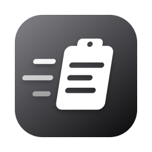

# Pace

<p align="center">
  
</p>

Pace is a private, local-first clipboard manager for macOS. It lives in the menu
bar, opens a compact searchable history with a global hotkey (default: `⌘⌥V`),
and pastes the selected item straight into the app you were using. Copied images
are OCR'd locally so their text is searchable and pasteable, and everything is
encrypted at rest. A companion `pace` CLI exposes the same history to scripts
and agents.

## Features

- Captures text, rich text, URLs, files, and images with their native pasteboard representations
- Keyboard-first panel: type to search, `⏎` pastes, `⌘⏎` copies, `⇧⏎` pastes as plain text, `⌥⏎` pastes an image's OCR text, `⌘1`–`⌘9` paste by position, `⌘⌫` deletes, `Esc` closes
- History grouped by date (Today, Yesterday, This Week, …) when browsing
- Automatic local OCR through Vision; recognized text participates in search
- Pasting an image into a text-only target falls back to its OCR text; terminals that support clipboard images (such as Claude Code via `Ctrl+V`) receive the actual image
- AES-GCM encrypted item files and search catalog; the vault key lives in the login keychain
- Sensitive pasteboard markers and recognizable credential formats are never stored
- Configurable retention limits by age, item count, and storage size
- Pause capture for a fixed interval or until resumed
- Same-user CLI access over a private Unix socket; no token system
- Import your existing Alfred clipboard history with one script

## Download

Signed and notarized builds are published on the [GitHub Releases page](https://github.com/danielcorin/Pace/releases).

## Why

I wanted a fast, minimal clipboard history that keeps everything on my Mac —
no cloud sync, no account, no subscription — and that my scripts and coding
agents can read and write through a real CLI instead of UI automation.

## Using Pace

1. Launch Pace and grant Accessibility permission when prompted (required to paste directly into other apps).
2. Copy things. Pace captures them in the background.
3. Press `⌘⌥V` to open the panel over your current app, search or arrow to an item, and press `⏎` to paste it into the app you came from.

Double-clicking a row pastes it; right-clicking offers paste variants, copy,
and pin. Press `⌘⏎` to copy the selected item without pasting it, or `⌘⌫` to
delete it from history. The panel hotkey is configurable in Settings (`⌘,`),
along with launch-at-login, retention limits, and the CLI installer.

## The pace CLI

In Settings, choose **Install Command Line Tool** to link the bundled CLI at
`~/.local/bin/pace`.

```sh
pace status
pace show                      # open the history panel
pace list --limit 20
pace search 'invoice type:image'
pace add 'generated by a script' --source agent
pace copy ITEM_ID
pace paste ITEM_ID --ocr-text
pace get ITEM_ID --ocr-text

pace retention show
pace retention set --days 30 --max-items 10000 --max-storage 1GB
```

The CLI launches the menu-bar service when needed, and the vault unlocks
automatically. `pace add` accepts `--timestamp` and `--source-kind` so imports
can preserve history.

### Importing from Alfred

```sh
scripts/import-alfred.sh
```

Imports Alfred's clipboard history — text and images, with original timestamps
and source apps. Entries pass through the normal capture path, so the
sensitive-content filter applies and duplicates merge. Raycast's history is
encrypted and cannot be imported.

## Requirements

- macOS 13 or later
- Xcode 16 or later (command-line tools) to build from source
- [XcodeGen](https://github.com/yonaskolb/XcodeGen) (`brew install xcodegen`)

## Build

The Xcode project is generated from `project.yml`; `*.xcodeproj` is not committed.

1. Clone the repository.
2. Copy `Configuration/Local.xcconfig.example` to `Configuration/Local.xcconfig`.
3. Set `DEVELOPMENT_TEAM` to your Apple Developer Team ID and choose a unique `PRODUCT_BUNDLE_IDENTIFIER`.
4. Generate and build:

```sh
brew install xcodegen
xcodegen generate
open Pace.xcodeproj    # or build from the command line:

xcodebuild \
  -project Pace.xcodeproj \
  -scheme Pace \
  -destination 'platform=macOS' \
  CODE_SIGNING_ALLOWED=NO \
  build

xcodebuild \
  -project Pace.xcodeproj \
  -scheme Pace \
  -destination 'platform=macOS' \
  CODE_SIGNING_ALLOWED=NO \
  test
```

The app build embeds the CLI at `Pace.app/Contents/Helpers/pace`.

The app icon and menu bar icon are drawn programmatically. After editing
`scripts/generate-icons.swift`, regenerate the PNGs in the asset catalog with:

```sh
swift scripts/generate-icons.swift
```

## Publishing a release

The release script reads the version, build number, bundle ID, and signing team
from the resolved Pace app target. Signing details come from the release
environment or the ignored `Configuration/Local.xcconfig`; no Apple
credentials are stored in the repository. The workflow follows
[Reco](https://github.com/danielcorin/Reco).

Copy the release environment template, fill in your Apple credentials and
GitHub repository, then allow direnv:

```sh
cp .env.example .env
$EDITOR .env
direnv allow
```

The ignored `.env` uses `APPLE_ID`, `APPLE_ID_PASSWORD`, `TEAM_ID`, and
optionally `DEVELOPER_ID_APPLICATION`. On the first release, the script
validates those values and stores the app-specific password in the
`PaceNotary` Keychain profile. Later releases reuse that profile.
`NOTARY_PROFILE` defaults to `PaceNotary`; the older `NOTARY_APPLE_ID`,
`DEVELOPER_IDENTITY`, and `DEVELOPMENT_TEAM` names remain supported. You can
also create the profile explicitly:

```sh
scripts/publish-release.sh --setup-notary-profile PaceNotary
```

Before a release, update `MARKETING_VERSION` and `CURRENT_PROJECT_VERSION` in
`project.yml`, regenerate the project, then commit and push those changes. Run:

```sh
scripts/publish-release.sh --dry-run    # inspect the release plan
scripts/publish-release.sh --publish    # build, notarize, and publish
```

The publish command requires a clean branch synchronized with its upstream. It
creates a universal Developer ID archive, uploads it through the Xcode account
configured on the Mac, waits for Apple notarization, exports and verifies the
stapled app, creates ZIP and DMG artifacts, separately notarizes and staples
the outer DMG, verifies SHA-256 checksums, and uploads all three artifacts to a
GitHub Release. It then replaces `/Applications/Pace.app` with the verified app
and launches it.

Use `--skip-install` to leave the installed app untouched. Passing an existing
notarized `.app` path skips the archive and app-notarization stages.
`--skip-dmg-notarization` is an explicit exception for private testing and is
not recommended for public releases.

## Privacy and permissions

Everything stays on your Mac. History items and the search catalog are
encrypted with AES-GCM; the key is held in your login keychain, dropped from
memory while the Mac sleeps or the session locks, and reloaded automatically.
Pasteboard types that mark transient or secret content, and text matching
recognizable credential formats, are never stored. Debug builds keep a separate
key and database under Pace's `Debug` support directory.

Pace is not sandboxed because it reads the general pasteboard and synthesizes
paste keystrokes; macOS Accessibility consent provides the user control for
that event posting. The CLI talks to the app over a mode-0600 Unix socket in
your home directory, so only your user can reach it. Pace makes no network
connections.

## AI disclosure

I made Pace using coding agent tools and LLMs.

## License

Licensed under the Apache License, Version 2.0. See [LICENSE](LICENSE).
